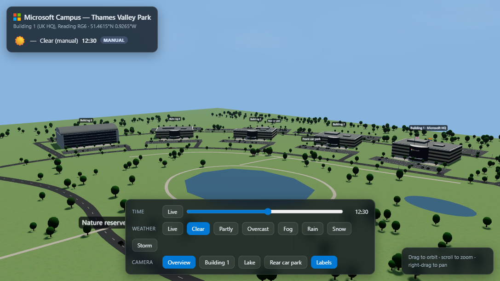
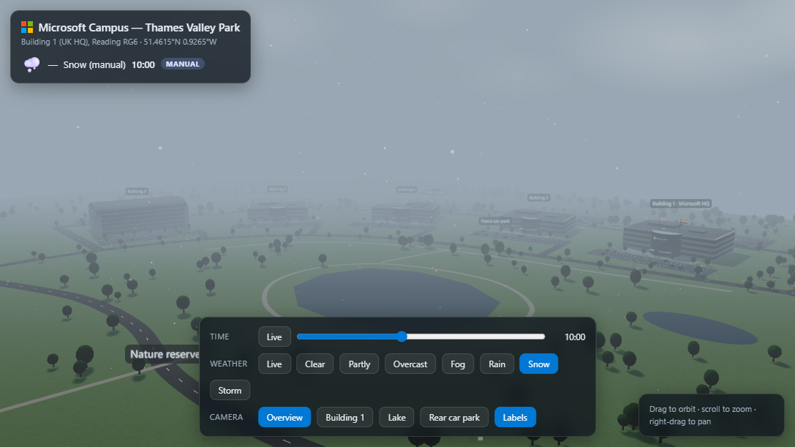
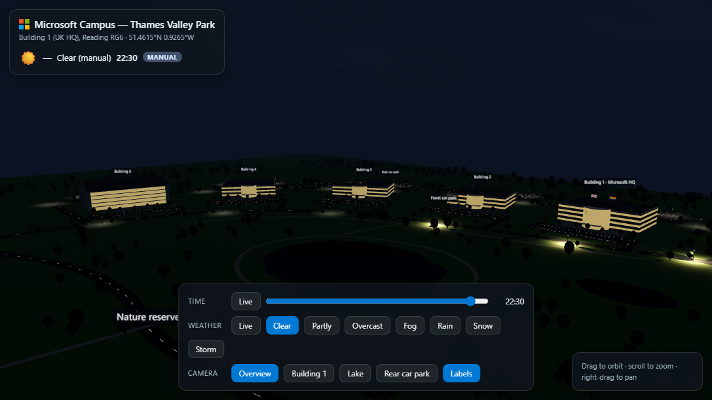
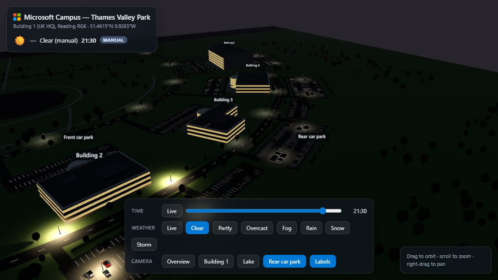
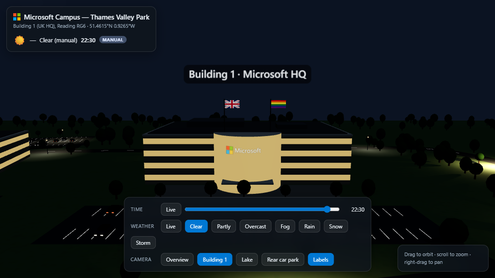

# Thames Valley Park — Microsoft UK Campus in 3D

An interactive 3D recreation of the Microsoft UK campus at Thames Valley Park, Reading (Building 1 – UK HQ, RG6 · 51.4615°N 0.9265°W), rendered entirely in the browser.

**Live site:** [tvp.guygregory.com](https://tvp.guygregory.com)



## What is this?

The whole experience is a single [index.html](index.html) — no build step, no backend. It uses [Three.js](https://threejs.org/) (loaded from a CDN via an import map) to procedurally build the campus: Buildings 1–5, the front and rear car parks, the lake, the nature reserve, surrounding roads, and animated traffic.

## Features

### ☀️ Live time of day

By default the scene runs on **live local time** — the sun and moon positions, sky colour, and lighting all match the real time in Reading. Drag the time slider to scrub through any minute of the day, from sunrise to midnight.

### 🌦️ Live weather

Current conditions are fetched from the free [Open-Meteo](https://open-meteo.com/) API (no API key required) and rendered in the scene — drizzle brings fog and rain particles, and the HUD shows the live temperature, conditions, and wind speed. You can also override the weather manually: **Clear, Partly, Overcast, Fog, Rain, Snow, or Storm**.



### 💡 Realistic street lighting with shadows

After dark, street lamps, car park lighting, and office windows switch on, casting soft pools of light and real-time shadows across the campus.





### 🚗 Traffic

Cars with working headlights and tail lights drive around the campus roads and the A329(M), and the car parks fill and empty with the time of day.

### 📷 Cameras

Preset camera angles — **Overview, Building 1, Lake, and Rear car park** — plus full orbit controls: drag to orbit, scroll to zoom, right-drag to pan. Building labels can be toggled on or off.



## How it works

- **Rendering** — Three.js `WebGLRenderer` with ACES filmic tone mapping and soft shadow maps; the entire campus geometry is generated procedurally in JavaScript (no model files).
- **Weather** — a `fetch` to the Open-Meteo forecast API for the campus coordinates; the WMO weather code drives fog density, cloud cover, precipitation particles, and the HUD badge (Live / Manual / Offline).
- **Time** — live mode tracks the system clock; manual mode maps the slider (0–1439 minutes) to sun/moon elevation, sky gradient, and lighting intensity.
- **Hosting** — a static GitHub Pages site, with the custom domain configured in [CNAME](CNAME).

## Running locally

Just open `index.html` in a browser, or serve it locally:

```bash
python -m http.server
```

then visit `http://localhost:8000`. An internet connection is needed for the Three.js CDN and live weather.
